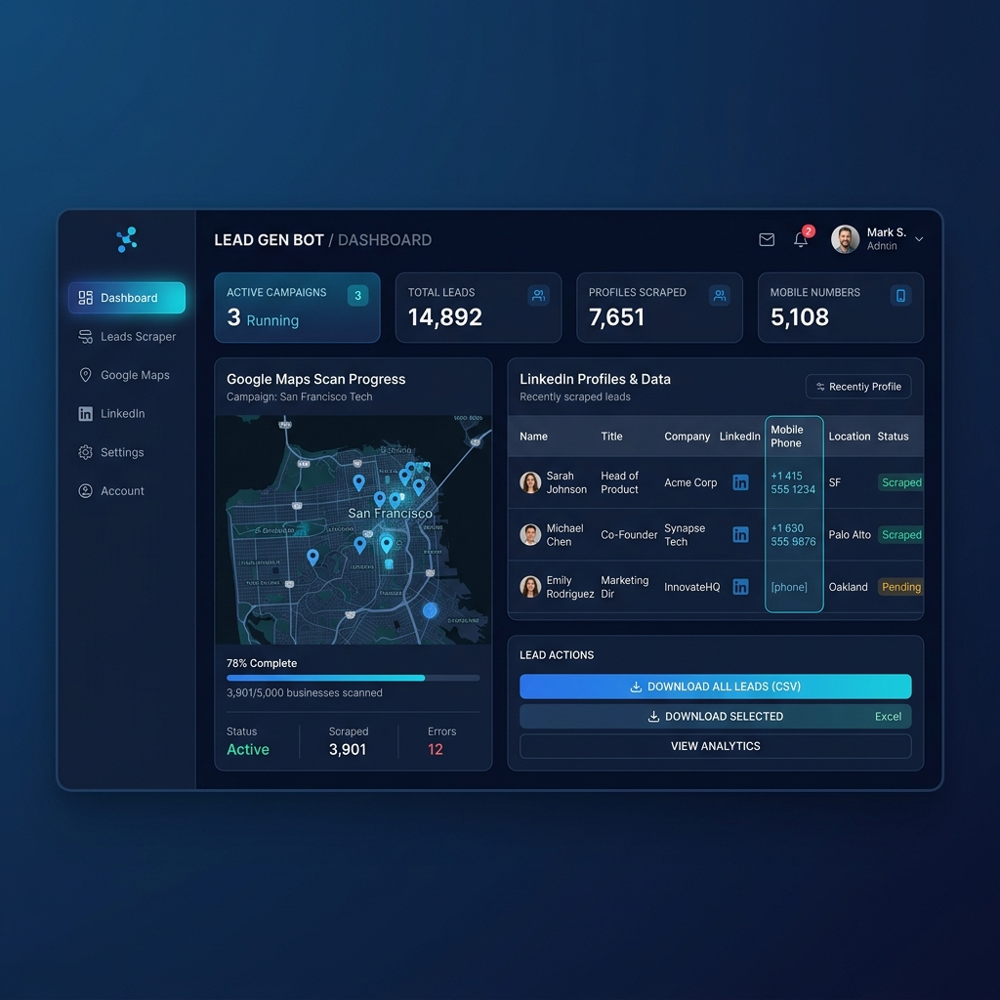

# B2B Lead Scraper Bot

[](#)
[](#)

An automated B2B lead generation tool utilizing Playwright and Selenium/Scrapers to gather mobile phone numbers and email contacts from Google Maps and LinkedIn profiles.



---

## 🇹🇷 Türkçe Açıklama

### Özellikler
- **Google Maps Taraması**: Belirli anahtar kelimeler ve konumlar için işletme profillerini tarar, web sitelerinden iletişim bilgilerini çeker.
- **LinkedIn Profil Taraması**: Karar vericileri (Kurucu, CEO, Avukat vb.) Google dorkları üzerinden tarar ve biyografilerinden iletişim bilgilerini ayıklar.
- **Kesin Mobil Filtresi**: Sadece `05xx` ile başlayan gerçek mobil telefon numaralarını filtreler (444, 212, 0850 gibi sabit hatları eler).
- **Geçmiş Kontrolü**: `lead_history.txt` dosyası yardımıyla daha önce çekilmiş numaraları kontrol ederek mükerrer kayıtları engeller.
- **Otomatik Raporlama**: Elde edilen temiz datayı anında `.xlsx` formatında Excel raporuna dönüştürür.

### Gereksinimler
```bash
pip install pandas openpyxl playwright
playwright install
```

### Kullanım
```bash
python main.py
```

---

## 🇬🇧 English Description

### Features
- **Google Maps Scraper**: Search businesses by keywords and locations, visiting websites to extract direct contact coordinates.
- **LinkedIn Profile Scraper**: Targets decision-makers (Founders, Owners, Partners) and parses snippets for active contact points.
- **Strict Mobile Filtering**: Isolates mobile numbers starting with standard `05...` prefixes, excluding landlines and corporate numbers.
- **Lead Verification**: Cross-references against `lead_history.txt` to eliminate duplicate outbound efforts.
- **Excel Generation**: Instantly saves parsed datasets to spreadsheets format for immediate sales use.

### Setup
```bash
pip install pandas openpyxl playwright
playwright install
```

### Run
```bash
python main.py
```
