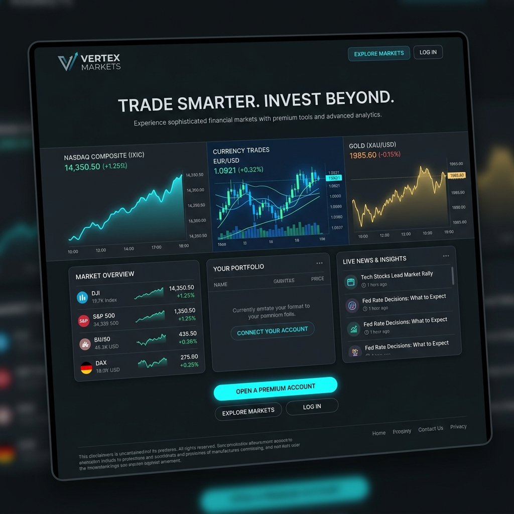

# Vertex Markets — Financial Landing Page

[](#)
[](#)
[](#)

A premium, responsive financial marketing landing page for the trading platform "Vertex Markets", showcasing currency rates, NASDAQ indices, commodity trackers, and integrated Telegram lead collection APIs.



---

## 🇹🇷 Türkçe Açıklama

### Özellikler
- **Gerçek Zamanlı Piyasa Takibi**: Altın, gümüş, petrol, NASDAQ ve kripto para fiyat göstergeleri.
- **Yapay Zeka Asistanı Entegrasyonu**: Özel "VerteX AI Bot" tanıtımı ve başvuru formu.
- **Telegram Bot Entegrasyonu**: Form dolduran kullanıcıların bilgileri anında Telegram bot API üzerinden belirlenen gruba iletilir.
- **Vercel Serverless Functions**: API isteklerini güvenli ve hızlı şekilde işlemek için `api/lead.js` sunucusuz fonksiyonu.

### Yerel Çalıştırma
Projeyi yerelde açmak için:
```bash
# Vercel CLI ile çalıştırma
vercel dev
```

---

## 🇬🇧 English Description

### Features
- **Real-Time Financial Indices**: Tracking indicators for Gold, Silver, Brent Oil, NASDAQ, and Bitcoin.
- **Vertex AI Bot Showcase**: Custom interactive signup options for AI-driven portfolio management.
- **Telegram Bot Notification API**: Automatically forwards user submission details straight to a specified Telegram group/channel.
- **Vercel Serverless Functions**: Serverless endpoint handling backend processes in `api/lead.js`.

### Local Development
To run the serverless local environment:
```bash
# Using Vercel CLI
vercel dev
```
